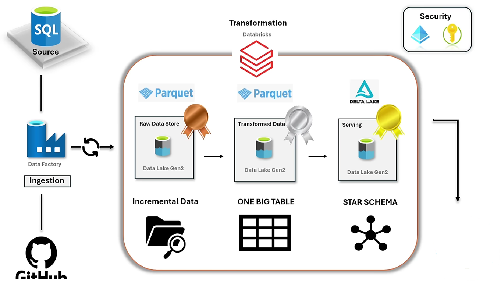

# Car Sales Data Engineering Project

## Overview
This Data Engineering project is an end-to-end implementation designed to provide hands-on experience with technologies such as Azure Data Factory, Databricks, and PySpark. It demonstrates how to utilize modern data engineering practices such as the Medallion architecture, Delta Lake, Delta Tables, and Unity Catalog for data governance.

## Architecture
The project follows the Medallion Architecture, which consists of three layers:

1. **Bronze Layer**:
   - Raw data ingestion.
   - Data is stored in Delta Tables with minimal transformations.

2. **Silver Layer**:
   - Data is cleaned and enriched.
   - Focuses on applying business logic and ensuring data quality.

3. **Gold Layer**:
   - Data is transformed into a dimensional model to support analytics and reporting.

## Key Features
- **Azure Data Factory**: Used to orchestrate the data pipeline.
- **Databricks**: Handles data processing and transformations.
- **PySpark**: Implements transformations at scale.
- **Delta Lake**: Provides efficient storage and enables ACID transactions.
- **Unity Catalog**: Manages data governance and security.
- **Dimensional Data Modeling**: Implements fact and dimension tables for analytics.
- **Slowly Changing Dimensions**: Handles evolving data scenarios efficiently.

## Data Model
The project organizes data into Fact and Dimension tables as follows:

### Fact Table
- **Fact_Sales**:
  - Captures transactional data including sales, revenue, and quantities.
  - Linked to various dimensions using surrogate keys.

### Dimension Tables
- **Dim_Branch**: Details about the dealership branches.
- **Dim_Date**: Captures calendar details for analytics.
- **Dim_Dealer**: Information about car dealers.
- **Dim_Model**: Details about car models.

## Files and Structure
- `gold_dim_branch.ipynb`: Jupyter notebook for branch dimension table.
- `gold_dim_date.ipynb`: Jupyter notebook for date dimension table.
- `gold_dim_dealer.ipynb`: Jupyter notebook for dealer dimension table.
- `gold_dim_model.ipynb`: Jupyter notebook for model dimension table.
- `gold_fact_sales.ipynb`: Jupyter notebook for fact sales table.
- `SalesData.csv`: Sample dataset for sales.
- `IncrementalSales.csv`: Sample dataset for incremental updates.
- `architecture.png`: Diagram showing the Medallion Architecture.
- `carsales de project.png`: Diagram showing the Fact-Dimension relationships.
- `databricks_workflow.png`: Visualization of the Databricks pipeline.
- `pipeline_runs.png`: Snapshot of pipeline executions.

## Getting Started
### Prerequisites
- Azure account with access to Azure Data Factory and Databricks.
- Python environment with PySpark installed.

### Steps
1. Set up Azure Data Factory to ingest raw data into the Bronze layer.
2. Use Databricks notebooks to process and transform data through the Silver and Gold layers.
3. Leverage Delta Lake for efficient data storage and querying.
4. Implement the dimensional data model as outlined above.

## Learning Outcomes
By the end of this project, you will:
- Understand how to implement the Medallion architecture.
- Gain hands-on experience with Delta Lake, PySpark, and Databricks.
- Learn best practices for Dimensional Data Modeling and Slowly Changing Dimensions.
- Be prepared to answer data engineering interview questions.

---
For more details, refer to the Jupyter notebooks and visualizations provided in the project files.

